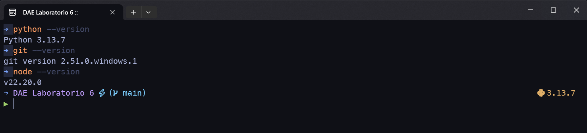
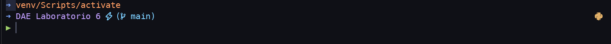
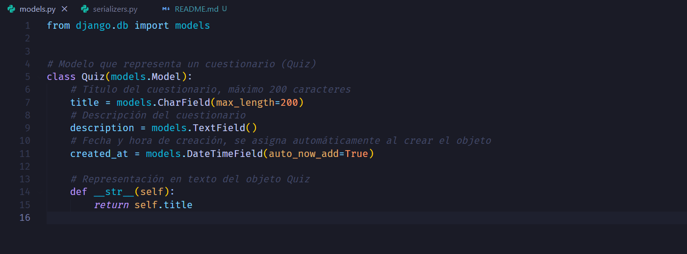
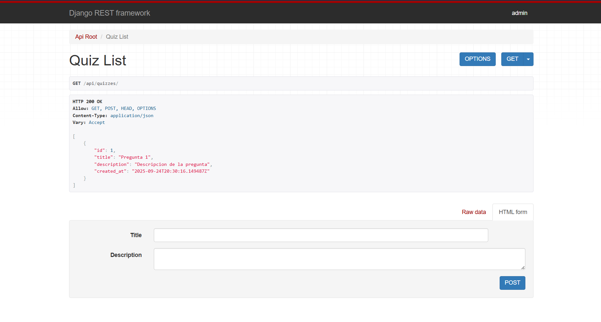
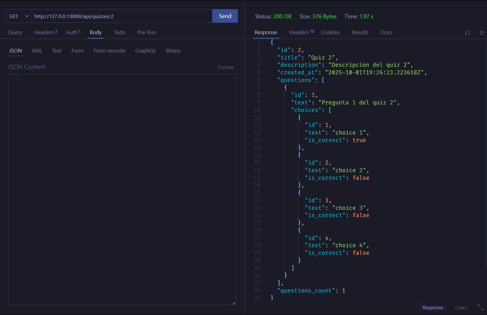

# Laboratorio 6: Sistema de Quiz con Django REST Framework

## 📋 Descripción

Este proyecto implementa un sistema de quiz/cuestionarios utilizando Django REST Framework.

## 📸 Capturas de Pantalla

### Versiones de los programas utilizados

### Entorno virtual activado

### Modelo quiz creado

### Aplicacion hecho en django rest framework 

### Aplicacion extendida con preguntas y opciones

